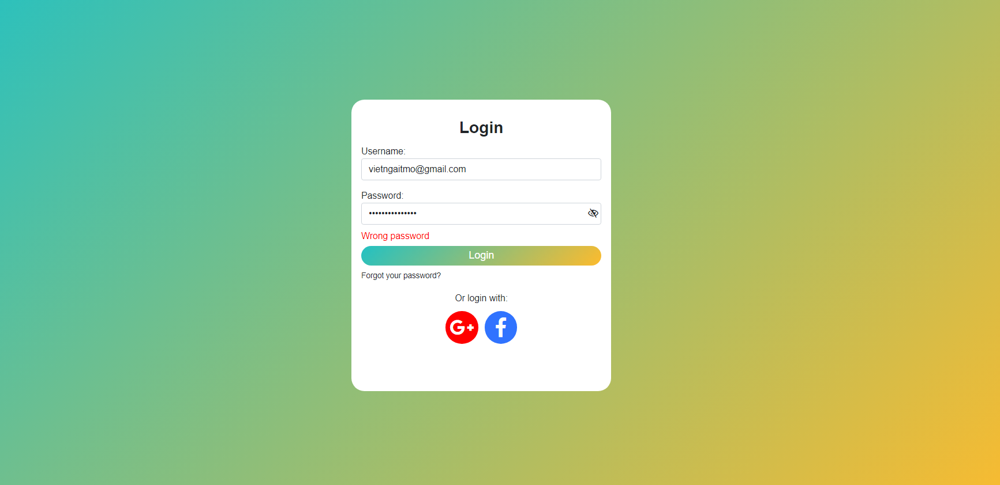
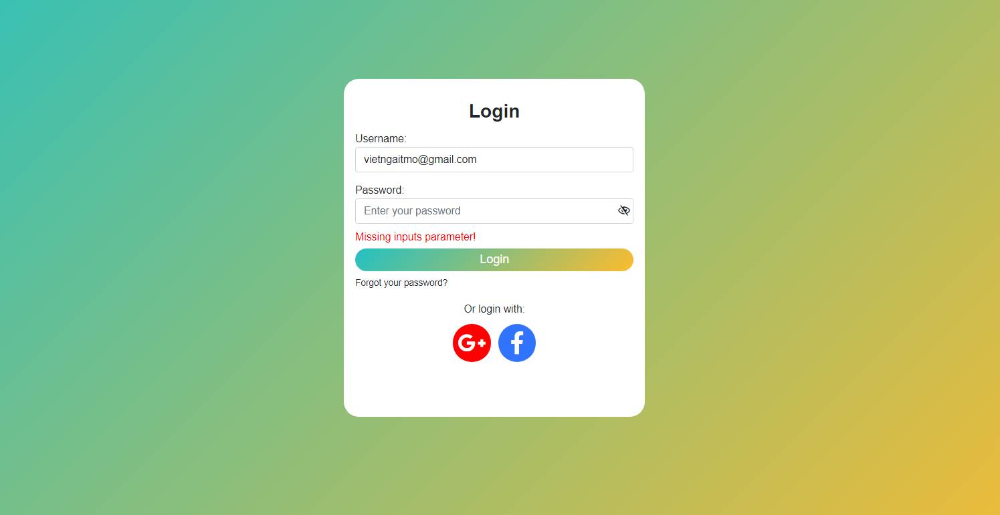
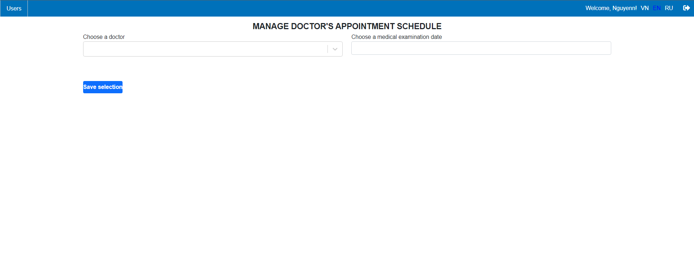
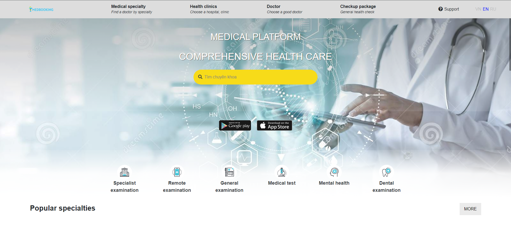
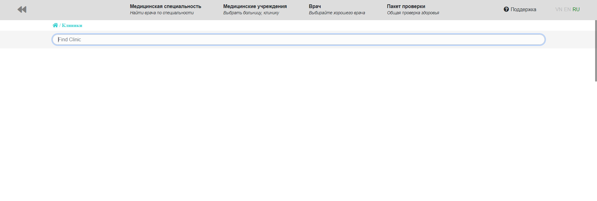

# For your healthy
### Completed 80% of the project.
Demo interface and function:
* Login
    * Login error
        

        

            
        

        

            
        

        

    * Doctor management interface
        

        

            
        

        

* HomePage

  

    
  

* Switch language

  

    
  

* Search function

  

    
  

