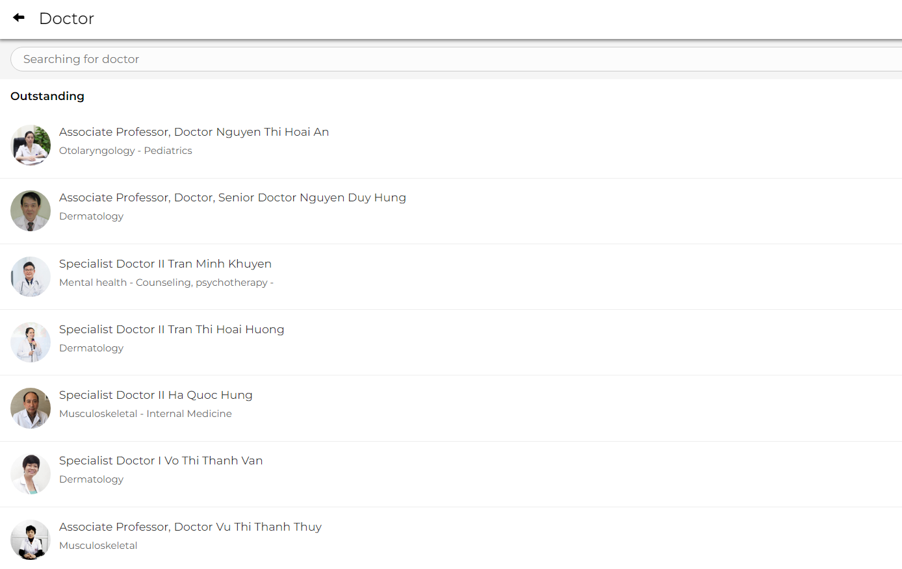
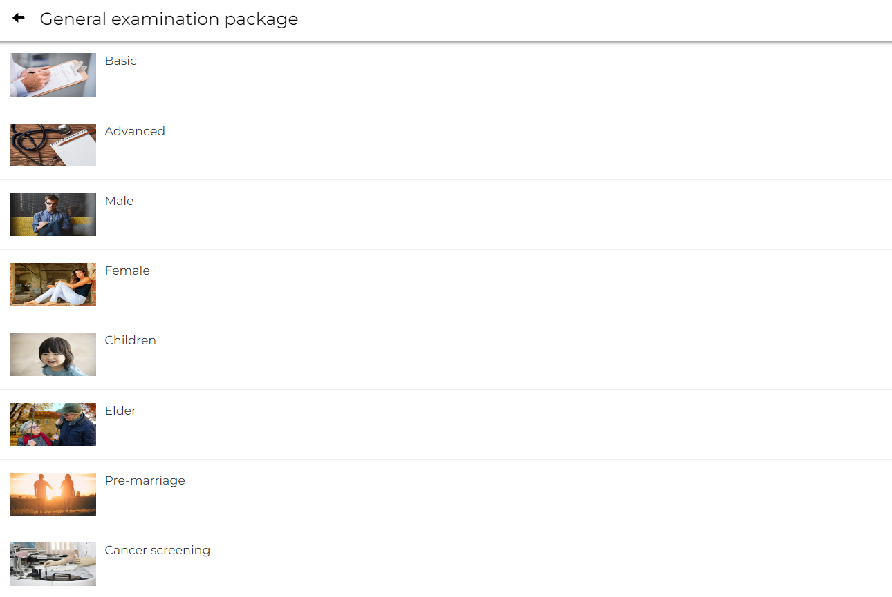

# For your healthy

  

<i>For the health of the whole community.</i>

## Author
* @jeremie2k1 [Нгуен Вьет Нга - P33201]
## Description
According to the recommendations of health experts, in a year, the average person should have regular health check-ups at least once and at least twice if the subject is the elderly, people with underlying diseases or weakened immunity. However, not everyone has time for regular check-ups because this work in the hospital requires a lot of time. With "For your healthy", everyone's medical examination and treatment will become easy, simple and fast. We, with a team of quality doctors, can visit and consult remotely, with a full range of medical specialties, hope to bring you a great medical examination and treatment experience. Just sit at home, select the items you want to check-up and choose a doctor, make an appointment, the doctors will be ready to examine and advise you on your health.  
## Technologies
* [Reactjs](https://reactjs.org/) - A JavaScript library for building user interfaces. 
* [Express.js](https://expressjs.com/) - Fast, unopinionated, minimalist web framework for Node.js.
* [Node.js](https://nodejs.org/en/about/) - As an asynchronous event-driven JavaScript runtime, Node.js is designed to build scalable network applications.
* [MySQL](https://www.mysql.com/) - An open-source relational database management system (RDBMS).
## Resource
* [Font awesome](https://fontawesome.com/) - A CSS and Less based font and icon toolkit.
* [Pexels](https://www.pexels.com/ru-ru/) - Free stock photos & videos with millions of high-quality royalty free stock images and copyright free images.
* [Google font](https://fonts.google.com/) - A library of 1455 open source font families and APIs for convenient use via CSS and Android.

* Third-Party API:
    * [Send API](https://developers.facebook.com/docs/messenger-platform/reference/send-api/) - The main API used to send messages to users, including text, attachments, structured message templates, sender actions, and more.
    * [Graph API](https://developers.facebook.com/docs/graph-api/reference/v15.0/object/reactions) - The primary way for apps to read and write to the Facebook social graph. 

## Features
* <b>User:</b> User can register for an account, log in, choose a form of examination (online / in person at the hospital), choose a specialty they want to visit, choose a doctor, choose a date and time for an appointment, rate for the doctor, contact doctor.
* <b>Doctor:</b> The doctor has the permission to accept or refuse the medical examination request from the user. Schedule a time when the patient can be seen. Answer for patient's question. Write own profile of the doctor.
* <b>Admin:</b> Admin has the permission to add, delete and edit doctor's information. Provide an account for the doctor. Block users from the site.
 
## Usecase

  

    
  

## Demo - Design

  

    
  

  
<b><i>Navigation Bar</i></b>

 

  

    
  

  
<b><i>Home Page</i></b>

 

  

    
  

  
<b><i>Hospital Outstanding</i></b>

 

  

    
  

  
<b><i>Remote Check-ups</i></b>

 

  

    
  

  
<b><i>Specialist</i></b>

 

  

    
  

  
<b><i>Specialist Searching</i></b>

 

  

    
  

  
<b><i>Doctor Searching</i></b>

 

  

    
  

  
<b><i>Package Check-ups Searching</i></b>

 

  

    
  

  
<b><i>Doctor Searching</i></b>

 

  

    
  

  
<b><i>Hospital Searching</i></b>

 
